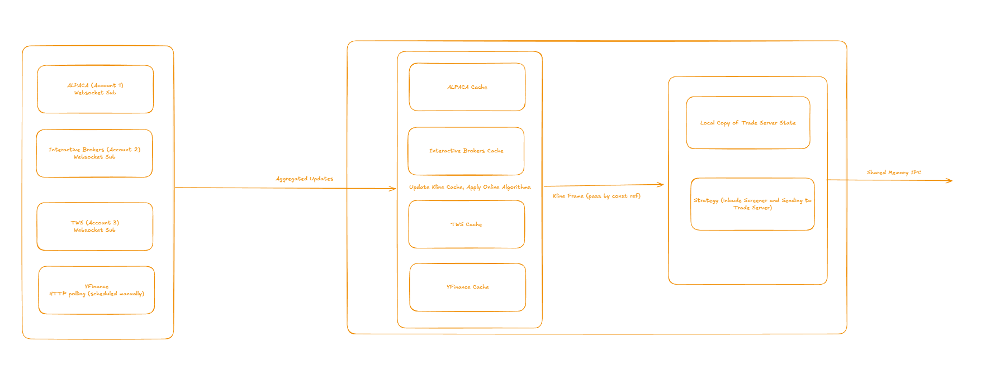
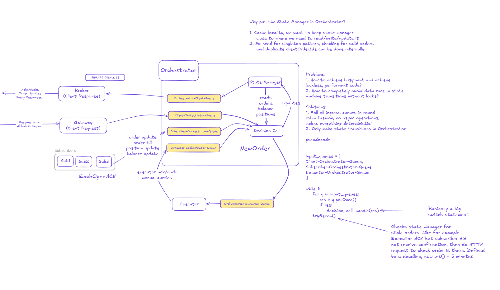

# System Review

## Data Flow

```
yfinance API → MDFeed (polling) → KlineCache → Handler → Strategy → PortfolioState
```

1. **MDFeed** polls yfinance sequentially for each ticker at fixed intervals
2. **KlineCache** maintains a rolling window of OHLCV data per ticker with automatic eviction
3. **Handler callback** (`on_kline_data`) triggers strategy logic with the full DataFrame
4. **Strategy** runs screen → signal → execute pipeline, updating **PortfolioState**

---

## 3 Strongest Aspects

### 1. Clean Separation of Concerns
- `md_feed/` module encapsulates all data fetching logic behind a facade
- Strategy logic (`screen`, `signal`, `execute`, `check_exit`) are pure functions operating on DataFrames
- State is isolated in `PortfolioState` dataclass, not scattered across the codebase

### 2. Effective Use of Dataclasses
- `Order`, `ExitResult`, `Position`, `PortfolioState` provide type-safe, immutable-ish data containers
- Self-documenting code with clear field names
- Easy to extend and serialize

### 3. Handler/Callback Pattern
- `KlineHandler` protocol decouples data feed from strategy implementation
- Strategy is injected into the feed system, enabling easy testing and swapping
- Single responsibility: feed handles data, strategy handles decisions

---

## What Can Be Improved for Live Trading

| Gap | Description |
|-----|-------------|
| **Real-time streaming** | Polling introduces latency; need WebSocket/FIX for live trading |
| **Online algorithms** | SMA/ATR recalculated from scratch each tick; use incremental updates |
| **State persistence** | In-memory only; crash = lost state |
| **Order failure handling** | No retry logic, no handling for rejected/partial fills |
| **Position reconciliation** | No sync with exchange; local state can drift from reality |
| **Lost order detection** | No mechanism to detect orders that never reached the exchange |
| **Fault tolerance** | No circuit breakers, no graceful degradation |

---

## Latency Bottleneck

**Location:** `MDFeed._poll_all()` at `md_feed/feed.py:77-91`

```python
for ticker in self._tickers:
    df = yf.Ticker(ticker).history(...)  # Sequential HTTP request
```

**Problem:** 20 tickers × ~200ms per request = 4+ seconds per poll cycle. In HFT, this is an eternity.

**Optimizations:**
1. **Real-time streaming** - Use APIs that support WebSocket or FIX protocol (e.g., Alpaca, Polygon, Interactive Brokers) to eliminate polling entirely
2. **Thread-per-core architecture** - Decouple data feed and strategy onto separate cores. Data feed thread handles ingress, strategy thread handles decisions. Communicate via lockless queues or shared memory IPC to avoid contention.
3. **Parallel requests** - If polling is unavoidable, use `asyncio` + `aiohttp` or `ThreadPoolExecutor` to fetch all tickers concurrently
4. **Batch API** - Use `yf.download(tickers, group_by='ticker')` for single request
5. **Online algorithms** - Replace `df["Close"].iloc[-50:].mean()` with incremental calculations that are amortized O(1) per tick (e.g., maintain running sum, add new value, subtract oldest value)

---

## Critical Missing Component

**Exchange State Reconciliation**

The system assumes local state is truth. In production:

- **Order fails?** Position opens locally but never executes. Strategy thinks it has exposure, doesn't hedge.
- **Exchange goes down?** No detection, no failover, continues trading blind.
- **Order lost in transit?** No acknowledgment tracking, no timeout-based recovery.
- **Partial fill?** System expects full fills only.

**Required:** Order management system (OMS) with:
- Order ID tracking and acknowledgment
- Periodic position reconciliation with exchange
- Dead letter queue for failed orders
- Heartbeat monitoring for exchange connectivity

---

## Major Failure Scenarios

### Scenario 1: Phantom Position

1. Strategy signals BUY for NVDA
2. `execute()` calls `state.open_position()` → local state now shows 100 shares
3. Network blip: order never reaches broker/exchange
4. Price drops 10%
5. `check_exit()` sees position, triggers SELL at loss
6. SELL order executes successfully (short selling 100 shares we don't own)
7. **Result:** Unintended short position, potential margin call, realized loss on position that never existed

**Root cause:** State updated optimistically before order confirmation. Production systems must update state only after exchange acknowledgment (or use pending/confirmed state machine).

### Scenario 2: Failed Exit / Stuck Position

1. Strategy holds 500 shares of SMCI at $100 entry
2. Price drops, `check_exit()` triggers trailing stop at $90
3. `close_position()` removes position from local state → system thinks we're flat
4. Exit market order fails (broker rejection, network timeout, insufficient liquidity)
5. System no longer tracks SMCI — position is "invisible"
6. Price continues dropping to $50, $30, $20...
7. **Result:** Unhedged exposure bleeding money with no stop loss protection. System won't attempt another exit because it believes position is already closed.

**Root cause:** `state.close_position()` is called before order execution is confirmed. No retry mechanism, no "pending exit" state, no reconciliation to detect the orphaned position.

**Required safeguards:**
- Exit orders must confirm before updating state
- Retry logic with exponential backoff for failed exits
- "Pending close" state that re-attempts exit on next tick
- Kill switch: force-flatten all positions if exit failures exceed threshold

---

## Reference: Production HFT Architecture

The diagrams below illustrate a production-grade architecture that addresses the limitations above:

### Data Feed Layer



- Multiple data sources (WebSocket + HTTP fallback)
- Per-source caches with online algorithm updates
- Pass kline frames by const reference (zero-copy)
- Strategy maintains local copy of trade server state
- Shared memory IPC for microsecond-latency order submission

### Orchestrator Pattern



**Key design decisions:**
- **State Manager co-located with Orchestrator** - Cache locality, no singleton pattern needed
- **Lockless queues** - Round-robin polling of all ingress queues, no async operations, fully deterministic
- **Single state owner** - Only Orchestrator mutates state, eliminates data races without locks
- **Reconciliation (`tryRecon()`)** - Checks for stale orders on deadline (e.g., executor ACK received but subscriber didn't confirm within `now_ns() + 5 minutes`)

This architecture was not implemented in the current system due to time constraints for this assessment.
